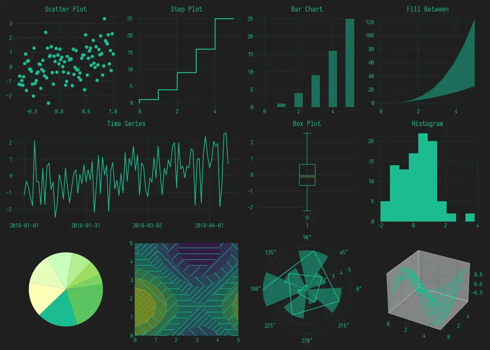

# data-viz-themes

Temas de gráficos personalizados para seguir a identididade visual do [geleiadementa.com](https://geleiadementa.com)

## Matplotlib: 

**Instruções:** coloco o arquivo [matplotlibrc](https://github.com/geleiadementa/data-viz-themes/blob/main/matplotlib/matplotlibrc) em ~/.config/matplotlib/

ou simplesmente execute os comando nos terminal:

```bash
mkdir -p ~/.config/matplotlib

curl https://github.com/geleiadementa/data-viz-themes/raw/main/matplotlib/matplotlibrc > ~/.config/matplotlib/matplotlibrc
```

obs.: ver solução temporária sobre gráficos em 3d em [#1](https://github.com/geleiadementa/data-viz-themes/issues/1)



## Bokeh

Salve [o arquivo yml](https://github.com/geleiadementa/data-viz-themes/blob/main/bokeh/theme.yml) e use o código abaixo para usa-lo:

```python
from bokeh.io import curdo
c = curdoc()

theme = bokeh.themes.theme.Theme("caminho_para_o_arquivo/bokeh_theme.yml")
c.theme = theme
```
